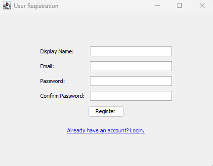

# Java Firebase Library Management System

This is a desktop application for managing a personal library of books, built using Java Swing for the user interface and Google Firebase for backend services (Authentication and Realtime Database). Each user has their own separate library.

## Features

*   **User Registration:** New users can create an account.
*   **User Login:** Existing users can log in to access their library.
*   **Per-User Libraries:** Each user has their own distinct collection of books.
*   **Add Books:** Users can add new books to their library (title, author, year).
*   **View Books:** Users can view a list of all books in their library.
*   **Real-time Updates:** The book list reflects database changes automatically.
*   **Logout:** Securely log out of the application.

## Application Showcase

### 1. Login Screen

New users can navigate to the registration page, while existing users can log in with their email and password.


---

### 2. Registration Screen

Users can register by providing a display name, email, and password. Basic validation is performed.



---

### 3. Main Library View (Book List)

After logging in, users see their personal library. If it's empty, a message prompts them to add books.


---

### 4. Per-User Data Isolation

Each user sees only their own books. Logging in with a different account will show a different set of books (or an empty library if that user hasn't added any).


---

### 7. Firebase Console - Authentication

Registered users appear in the Firebase Authentication console.

*(Image: `firebase-auth-users.png` - Replace with your actual image URL)*

*Caption: Users listed in the Firebase Authentication section.*

---

### 8. Firebase Console - Realtime Database

Book data is stored under each user's unique ID (UID) in the Realtime Database.

*(Image: `firebase-database-structure.png` - Replace with your actual image URL)*

*Caption: Data structure in Firebase Realtime Database showing per-user book collections.*

---

## Prerequisites

*   Java Development Kit (JDK) 11 or higher.
*   Apache Maven (for managing dependencies and building the project).
*   An active Google Firebase project.

## Firebase Setup

This application requires a Firebase project for authentication and data storage.

1.  **Create a Firebase Project:**
    *   Go to the [Firebase Console](https://console.firebase.google.com/).
    *   Click "Add project" and follow the on-screen instructions.

2.  **Enable Firebase Authentication:**
    *   In your Firebase project, navigate to "Build" > "Authentication".
    *   Click "Get started".
    *   Under "Sign-in method", enable the "Email/Password" provider.

3.  **Set up Realtime Database:**
    *   Navigate to "Build" > "Realtime Database".
    *   Click "Create Database".
    *   Choose a server location.
    *   Select "Start in **locked mode**" for security rules. Click "Enable".
    *   Go to the "Rules" tab and replace the default rules with the following to enable per-user libraries:
        ```json
        {
          "rules": {
            "library_app_data": {         // This must match the root node in DatabaseHandler.java
              "user_libraries": {
                "$uid": {                 // $uid is a wildcard for any Firebase User ID
                  "books": {
                    ".read": "auth != null && auth.uid == $uid",
                    ".write": "auth != null && auth.uid == $uid"
                  }
                }
              }
            }
          }
        }
        ```
    *   Click "Publish".

4.  **Get Firebase Configuration Details:**
    *   **Service Account Key:**
        *   In Project settings (gear icon) > "Service accounts".
        *   Under "Firebase Admin SDK", click "Generate new private key".
        *   Rename the downloaded JSON file to `serviceAccountKey.json`.
    *   **Web API Key & Database URL:**
        *   In Project settings > "General" tab.
        *   If no app is listed under "Your apps", add a web app ( `</>` icon). No need to add the SDK script tags.
        *   Copy the `apiKey` from the `firebaseConfig` object.
        *   Go back to "Build" > "Realtime Database". Copy the database URL (e.g., `https://your-project-id-default-rtdb.firebaseio.com/`).

## Project Setup

1.  **Clone the Repository (or download the source code):**
    ```bash
    git clone <repository-url>
    cd <project-directory>
    ```

2.  **Place Firebase Service Account Key:**
    *   Copy the `serviceAccountKey.json` file (obtained in Firebase Setup Step 4) into the `src/main/resources/` directory of the project.

3.  **Configure Firebase Credentials in Code:**
    *   Open `src/main/java/database/DatabaseHandler.java`.
    *   Update the following static final strings with your Firebase project's details (obtained in Firebase Setup Step 4):
        ```java
        private static final String FIREBASE_API_KEY = "YOUR_WEB_API_KEY_HERE";
        private static final String FIREBASE_DATABASE_URL = "YOUR_FIREBASE_DATABASE_URL_HERE";
        ```

4.  **Build the Project (using Maven):**
    ```bash
    mvn clean install
    ```
    This will download the necessary dependencies, including the Firebase Admin SDK and `org.json`.

## Running the Application

After successfully building the project:

1.  **Locate the JAR file:**
    The executable JAR file will typically be in the `target/` directory (e.g., `target/your-project-name-1.0-SNAPSHOT-jar-with-dependencies.jar` if you've configured the maven-assembly-plugin, or you can run from your IDE).

2.  **Run from Command Line (if you have an executable JAR):**
    ```bash
    java -jar target/your-project-name-1.0-SNAPSHOT-jar-with-dependencies.jar
    ```
    (Replace `your-project-name-1.0-SNAPSHOT-jar-with-dependencies.jar` with the actual name of your JAR file).

3.  **Run from IDE:**
    *   Import the project into your IDE (IntelliJ IDEA, Eclipse, etc.) as a Maven project.
    *   Locate the `Main.java` file (likely in a package like `src/main/java/` at the root or in an `app` package).
    *   Run the `main` method in `Main.java`.

## Default Admin User (Optional)

The application attempts to create a default admin user upon first initialization:
*   **Email:** `admin@example.com`
*   **Password:** `admin123`

This user is created for testing purposes. You can modify or remove this behavior in `DatabaseHandler.java` by commenting out the call to `initializeDefaultAdminUser()`.

## Project Structure (Key Files)

*   `src/main/java/`
    *   `Main.java`: Entry point of the application.
    *   `model/`: Contains data model classes (POJOs).
        *   `Book.java`: Represents a book.
        *   `User.java`: Represents a user.
    *   `database/`: Handles Firebase interactions.
        *   `DatabaseHandler.java`: Core class for Firebase Admin SDK initialization, authentication, and database operations.
    *   `ui/`: Contains Swing GUI frame classes.
        *   `LoginFrame.java`: Handles user login.
        *   `RegistrationFrame.java`: Handles new user registration.
        *   `MainFrame.java`: Main application window for displaying and adding books.
*   `src/main/resources/`
    *   `serviceAccountKey.json`: Your Firebase service account private key (you must add this).
*   `pom.xml`: Maven project configuration file, including dependencies.

## Troubleshooting

*   **`serviceAccountKey.json` not found:** Ensure the file is correctly named and placed in `src/main/resources/` and that your build process includes resources from this directory.
*   **Firebase Initialization Failed:**
    *   Double-check `FIREBASE_API_KEY` and `FIREBASE_DATABASE_URL` in `DatabaseHandler.java`.
    *   Verify your `serviceAccountKey.json` is valid and for the correct project.
    *   Ensure your machine has internet access to reach Firebase services.
    *   Check the console output for detailed error messages.
*   **Authentication Errors:**
    *   Ensure Email/Password sign-in is enabled in your Firebase project.
    *   Verify the `FIREBASE_API_KEY` is correct for the REST API calls.
*   **Database Permission Denied:**
    *   Check your Realtime Database rules in the Firebase console. Ensure they allow read/write access as intended (especially for authenticated users to their specific paths).

---

Feel free to contribute or report issues!
